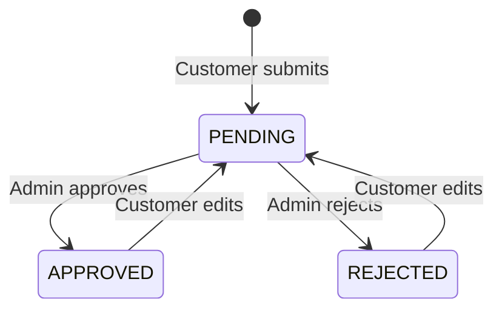

# RealNest – Real Estate Listing Platform

RealNest is a full-stack real estate listing platform built with Spring Boot and Thymeleaf. It allows customers to publish and manage property listings, while administrators review listings before they become publicly visible.

The application includes role-based access, property search and filtering, Cloudinary image uploads, enquiries, password reset through email, Swagger API documentation, and automated testing.

## Live Application

> Deployment URL will be added after deployment.

- Application: https://realnest-preethi.onrender.com/
- Swagger UI: https://realnest-preethi.onrender.com/swagger-ui/index.html

## Demo Credentials

### Administrator

- Email: admin@mail.com
- Password: admin@123

### Customer

Customers can create a new account using the registration page.

Optional demo customer:

- Email: `<CUSTOMER_EMAIL>`
- Password: `<CUSTOMER_PASSWORD>`

> These accounts are intended only for project demonstration and evaluation.

## Features

### Public Features

- Browse approved properties without logging in
- Browse properties available for sale or rent
- Search properties by city and locality
- Filter by listing type, property type, bedrooms, and budget
- View property details and image galleries
- Send enquiries for approved properties
- Prevent property owners from enquiring about their own listings

### Customer Features

- Customer registration and login
- Session-based authentication with Remember Me
- Customer dashboard
- Create property listings
- Upload up to eight property images
- Edit and delete owned properties
- Remove existing property images
- View listing approval status
- View enquiries received for owned properties
- Update customer profile
- Request and complete password resets through email

New and edited properties are assigned `PENDING` status and require administrator approval before appearing publicly.

### Administrator Features

- Administrator dashboard
- View platform and property statistics
- Review pending property submissions
- Approve or reject property listings
- View all properties
- View registered customers and their listings
- View property enquiries
- Role-protected administrator routes

## Property Lifecycle



Only properties with `APPROVED` status are displayed on public property pages.

## Technology Stack

### Backend

- Java 21
- Spring Boot 4.1.0
- Spring MVC
- Spring Data JPA
- Spring Security
- Hibernate
- Jakarta Bean Validation
- Maven
- Lombok

### Frontend

- Thymeleaf
- Thymeleaf Spring Security Extras
- Tailwind CSS
- HTML5
- JavaScript

### Database and External Services

- MySQL
- Cloudinary for property image storage
- Gmail SMTP for password-reset emails
- H2 for testing

### API and Testing

- Springdoc OpenAPI / Swagger UI
- JUnit 5
- Mockito
- MockMvc

## Architecture

RealNest follows a layered architecture:

```text
Controller
    ↓
Service
    ↓
Repository
    ↓
Database
```

- **View controllers** render Thymeleaf pages.
- **REST controllers** expose documented API endpoints.
- **Services** contain application and business logic.
- **Repositories** manage database operations using Spring Data JPA.
- **DTOs** transfer validated request and response data.
- **Mappers** convert between entities and DTOs.
- **Security configuration** manages authentication and role-based authorization.

## Main Entities

### User

Stores customer and administrator account information.

Important fields:

- Name
- Email
- Encoded password
- Phone
- Role
- Creation date

Roles:

- `CUSTOMER`
- `ADMIN`

### Property

Stores property listing information, including:

- Title and description
- Price
- Property and listing types
- Bedrooms and bathrooms
- Area
- Address, locality, city, state, country, and pincode
- Geographic coordinates
- Approval status
- Owner
- Creation and update timestamps

Statuses:

- `PENDING`
- `APPROVED`
- `REJECTED`

### PropertyImage

Stores Cloudinary image information:

- Image URL
- Cloudinary public ID
- Display order
- Associated property

### Enquiry

Stores enquiries submitted for approved properties:

- Property
- Name
- Email
- Phone
- Message
- Creation date

### PasswordResetToken

Stores time-limited, single-use password-reset tokens.

## Main REST API Endpoints

### Property APIs

| Method | Endpoint | Description |
|---|---|---|
| `POST` | `/api/properties` | Create a property |
| `GET` | `/api/properties/{propertyId}` | Get a property by ID |
| `GET` | `/api/properties/search` | Search approved properties |
| `GET` | `/api/properties/owner/{ownerId}` | Get properties by owner |
| `GET` | `/api/properties/status/{status}` | Get properties by status |
| `PUT` | `/api/properties/{propertyId}` | Update a property |
| `DELETE` | `/api/properties/{propertyId}` | Delete a property |
| `PATCH` | `/api/properties/{propertyId}/approve` | Approve a property |
| `PATCH` | `/api/properties/{propertyId}/reject` | Reject a property |
| `POST` | `/api/properties/{propertyId}/images` | Upload property images |
| `GET` | `/api/properties/{propertyId}/images` | Get property images |
| `DELETE` | `/api/properties/{propertyId}/images/{imageId}` | Delete an image |

### Enquiry APIs

| Method | Endpoint | Description |
|---|---|---|
| `POST` | `/api/properties/{propertyId}/enquiries` | Send an enquiry |
| `GET` | `/api/enquiries/owner/{ownerId}` | Get enquiries received by an owner |
| `GET` | `/api/enquiries/property/{propertyId}` | Get enquiries for a property |

### User APIs

| Method | Endpoint | Description |
|---|---|---|
| `POST` | `/api/users/register` | Register a customer |
| `GET` | `/api/users/{userId}` | Get a user profile |
| `PUT` | `/api/users/{userId}` | Update a user profile |
| `GET` | `/api/users/customers` | Get all customers |
| `GET` | `/api/users/customers/count` | Get the customer count |
| `POST` | `/api/users/forgot-password` | Request a password-reset link |
| `POST` | `/api/users/reset-password` | Reset a password |

The complete API documentation can be accessed through Swagger UI:

```text
http://localhost:8080/swagger-ui/index.html
```

## Security

RealNest uses Spring Security with session-based authentication.

Security features include:

- BCrypt password encoding
- Role-based route authorization
- Custom login and logout flow
- Remember Me support
- CSRF protection
- Authenticated customer and administrator routes
- Ownership validation for property modification
- Password-reset tokens with expiration and single-use enforcement

The application intentionally uses session-based authentication instead of JWT because the frontend is rendered using Thymeleaf.

## Image Uploads

Property images are uploaded to Cloudinary.

- A property can contain up to eight images.
- The first image is used as the primary property image.
- Cloudinary public IDs are stored for image deletion.
- Images are deleted from Cloudinary when their associated listing or image is removed.
- Multipart requests support a maximum total request size of 80 MB.

## Testing

RealNest includes automated tests for backend services and REST controllers.

### Service Tests

JUnit 5 and Mockito are used to test:

- Property creation and status management
- Missing property and owner handling
- Enquiry creation
- Self-enquiry prevention
- User registration
- Duplicate account validation
- Password validation

### REST Controller Tests

MockMvc and Mockito are used to verify:

- HTTP request mapping
- Response status codes
- JSON response structures
- Property APIs
- Enquiry APIs
- User APIs

Run all tests with:

```bash
./mvnw test
```

On Windows:

```powershell
.\mvnw.cmd test
```

## Local Setup

### Prerequisites

Install:

- Java 21
- Maven, or use the included Maven wrapper
- MySQL
- A Cloudinary account
- A Gmail account with an app password for SMTP

### 1. Clone the Repository

```bash
git clone <REPOSITORY_URL>
cd realNest
```

### 2. Create the Database

```sql
CREATE DATABASE realnest;
```

### 3. Configure Environment Variables

The application requires the following environment variables:

| Variable | Description |
|---|---|
| `REALNEST_DB_URL` | MySQL JDBC connection URL |
| `DB_USERNAME` | MySQL username |
| `DB_PASSWORD` | MySQL password |
| `CLOUDINARY_CLOUD_NAME` | Cloudinary cloud name |
| `CLOUDINARY_API_KEY` | Cloudinary API key |
| `CLOUDINARY_API_SECRET` | Cloudinary API secret |
| `MAIL_USERNAME` | Gmail address used for email |
| `MAIL_PASSWORD` | Gmail app password |
| `APP_BASE_URL` | Application base URL |

Example values:

```text
REALNEST_DB_URL=jdbc:mysql://localhost:3306/realnest
DB_USERNAME=root
DB_PASSWORD=your_database_password

CLOUDINARY_CLOUD_NAME=your_cloud_name
CLOUDINARY_API_KEY=your_api_key
CLOUDINARY_API_SECRET=your_api_secret

MAIL_USERNAME=your_email@gmail.com
MAIL_PASSWORD=your_gmail_app_password

APP_BASE_URL=http://localhost:8080
```

Never commit actual passwords or API credentials to the repository.

### 4. Run the Application

On Windows:

```powershell
.\mvnw.cmd spring-boot:run
```

On macOS or Linux:

```bash
./mvnw spring-boot:run
```

Open:

```text
http://localhost:8080
```

## Configuration

The application uses the following important settings:

- Hibernate schema update: `ddl-auto: update`
- Server port: `8080`
- Session timeout: `30 minutes`
- Maximum individual file size: `10 MB`
- Maximum multipart request size: `80 MB`
- Password-reset links use `APP_BASE_URL`
- Thymeleaf caching is disabled during development

## Project Structure

```text
src
├── main
│   ├── java/com/capstone/realNest
│   │   ├── config
│   │   ├── controller
│   │   │   ├── rest
│   │   │   └── view
│   │   ├── dto
│   │   ├── entity
│   │   ├── enums
│   │   ├── exception
│   │   ├── mapper
│   │   ├── repository
│   │   ├── security
│   │   └── service
│   └── resources
│       ├── static
│       │   ├── images
│       │   └── js
│       ├── templates
│       │   ├── admin
│       │   ├── auth
│       │   ├── customer
│       │   ├── fragments
│       │   └── public
│       └── application.yml
└── test
    └── java/com/capstone/realNest
        ├── controller/rest
        └── service
```

## Future Enhancements

- Wishlist and saved-property functionality
- Property image drag-and-drop reordering
- Map-based property discovery
- Email notifications for property approval or rejection
- Enquiry status tracking
- Customer-to-owner messaging
- Advanced administrator reports
- Production-ready Tailwind CSS build instead of CDN usage

## Author

**Preethi KJ**

Capstone project developed as a full-stack Spring Boot application.

## License

This project was created for educational and capstone evaluation purposes.
